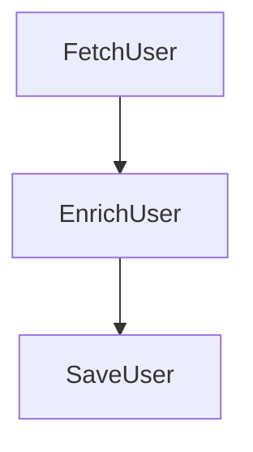

# FlowForge

**Forge reactive workflows with precision.**

FlowForge is a lightweight, strongly-typed, reactive workflow orchestration engine for Java. It enables you to define, execute, and monitor complex business workflows composed of reusable tasks, executed asynchronously using Project Reactor.

FlowForge is designed for **embedded, high-concurrency, short-lived workflows** where determinism, type safety, and observability matter more than heavyweight BPM or distributed durability.

---

## 🚀 Key Features

*   ✅ **Embedded**: No external runtime or database required.
*   ✅ **Reactive**: Fully built on Project Reactor (Mono/Flux), non-blocking by default.
*   ✅ **Declarative**: Define workflows using a fluent, type-safe DSL.
*   ✅ **Reusable**: Tasks are independent components that can participate in multiple workflows.
*   ✅ **Fail-Fast**: Invalid DAGs (cycles, broken dependencies) fail at startup.
*   ✅ **Spring-Native**: First-class Spring Boot integration with auto-configuration.

---

## 📦 Installation

Add the starter dependency to your project:

### Gradle

```gradle
implementation("io.flowforge:flowforge-spring-boot-starter:1.0.0")
```

### Maven

```xml
<dependency>
  <groupId>io.flowforge</groupId>
  <artifactId>flowforge-spring-boot-starter</artifactId>
  <version>1.0.0</version>
</dependency>
```

---

## 🛠️ Usage Guide

### 1. Defining a Task (`@FlowTask`)

A task is a standard Spring `@Component` that implements `FlowTaskHandler`. It is isolated, testable, and reusable.

```java
@FlowTask(id = "TaskA")
@Component
public class TaskA implements FlowTaskHandler<String, String> {

    @Override
    public Mono<String> execute(String input, ReactiveExecutionContext ctx) {
        return Mono.just(input + "-processed");
    }
}
```

### 2. Defining a Workflow (`@FlowWorkflow`)

Workflows are defined as `@Bean` methods that return a `WorkflowExecutionPlan`. The `FlowDsl` builder validates valid paths and broken dependencies.

```java
@Configuration
public class WorkflowConfig {

    @FlowWorkflow(id = "sampleFlow")
    @Bean
    WorkflowExecutionPlan sampleFlow(FlowDsl dsl) {
        return dsl
            .start("TaskA")
            .then("TaskB")
            .build();
    }
}
```

**Supported DSL Operations:**
*   `start(taskId)`: Defines the entry point.
*   `then(taskId)`: Chains tasks sequentially.
*   `fork(taskId...)`: Executes multiple tasks in parallel.
*   `join(taskId)`: Merges parallel branches (waits for dependencies).

Example of a complex flow:
```java
dsl.start("FetchData")
   .fork("ProcessImage", "AnalyzeText")
   .join("AggregateResults")
   .then("SaveToDb")
   .build();
```

### 3. Executing a Workflow

Inject `FlowForgeClient` and execute the workflow by its ID. It returns a `Mono<ReactiveExecutionContext>` containing the results.

```java
@Service
public class WorkflowService {

    private final FlowForgeClient client;

    public WorkflowService(FlowForgeClient client) {
        this.client = client;
    }

    public Mono<String> run() {
        return client.execute("sampleFlow", "initial-input")
                     .map(ctx -> ctx.get("TaskB", String.class).orElse("default"));
    }
}
```

---

## 🏗️ Architecture

FlowForge follows a programmatic orchestration model:

1.  **Workflow Definition**: Strongly typed objects defining logic and dependencies.
2.  **Validation**: Structural analysis of the DAG (Directed Acyclic Graph) at startup.
3.  **Orchestrator**: Event-driven engine using `Sinks` and `Schedulers`.
    - **State Loop**: Single-threaded serializer for state updates (lock-free safety).
    - **Worker Loop**: Parallel execution of tasks on bounded schedulers.
4.  **Execution Context**: Thread-safe storage for passing data downstream.

---

## 🚫 Scope (Non-Goals)

FlowForge is intentionally **not**:
*   A distributed workflow engine (no database persistence required).
*   A BPMN visual tool.
*   A replacement for Temporal/Camunda (use those for long-running, durable processes).

**Use FlowForge for**: High-frequency composite API handling, parallel data aggregation, and complex in-memory business logic pipelines.

# FlowForge

**Type-safe, reactive workflow orchestration for Java.**

FlowForge is a lightweight, strongly-typed workflow engine that lets you define, validate, execute, and observe complex business flows with **compile-time guarantees and production-grade observability**.

---

## 🚀 Why FlowForge?

Most workflow engines trade off between:

* Type safety ❌
* Simplicity ❌
* Observability ❌

FlowForge does not.

It provides:

* ✅ **End-to-end type safety** (no runtime casting surprises)
* ✅ **Reactive execution** (built on Project Reactor)
* ✅ **Fail-fast validation** (compiler-style DAG checks)
* ✅ **Built-in observability** (OpenTelemetry + execution tracing)
* ✅ **Lightweight & embeddable** (no external runtime required)

---

## ⚡ Quick Example

```java
return dsl.startTyped(fetchUser())
          .then(enrichUser())
          .then(saveUser())
          .build();
```

That’s it.

---

## 🧠 Type Safety — First Class Citizen

FlowForge enforces type correctness across the entire workflow:

```java
TaskDefinition<UserId, User> fetchUser;
TaskDefinition<User, EnrichedUser> enrichUser;
TaskDefinition<EnrichedUser, Void> saveUser;
```

The system guarantees:

* Output of one task matches input of the next
* No invalid connections compile
* No unsafe casts at runtime

---

## 🔑 Safe Data Access with FlowKey

No more:

```java
context.get(taskId, String.class); // ❌ unsafe
```

Instead:

```java
FlowKey<User> userKey = fetchUser.outputKey();
User user = context.getOrThrow(userKey);
```

✔ Type-safe
✔ No duplication
✔ No runtime surprises

---

## 🧱 Compiler-Style Validation

FlowForge validates your workflow before execution:

* ❌ Type mismatches
* ❌ Missing inputs
* ❌ Unreachable nodes
* ❌ Invalid DAG structures

Errors are reported like a compiler:

```
TYPE_MISMATCH: Task 'EnrichUser' expects User but received Order
```

---

## ⚙️ Reactive Execution Engine

Built on Project Reactor:

* Non-blocking execution
* High concurrency
* Backpressure-aware
* Deterministic DAG scheduling

---

## 📊 Built-in Observability

### 🔍 Execution Trace (Debug Mode)

```java
ExecutionTrace trace = client.executeWithTrace("workflow", input);
```

Gives you:

* Per-task timing
* Execution order
* Errors and stack traces
* Correlated `traceId`

---

### 🌐 OpenTelemetry Integration

Out of the box:

* Distributed tracing
* Compatible with Jaeger, Zipkin, Tempo, etc.

Structure:

```
Workflow Span
 ├── Task Span
 ├── Task Span
 └── Task Span
```

✔ Includes:

* workflow.id
* task.id
* execution.id
* status

✔ Supports:

* Span links (for DAG joins)
* Low-cardinality safe attributes

---

## 📈 Visualize Your Workflows

### Mermaid Export



### JSON Export

Perfect for tooling and debugging pipelines.

---

## 🧩 Architecture Overview

```
DSL → Execution Plan → Orchestrator → Observability
```

* **DSL**: Type-safe workflow definition
* **Validation**: Compiler-style checks
* **Execution**: Reactive DAG engine
* **Tracing**: Internal + OpenTelemetry

---

## 🛡️ Production Ready

FlowForge is designed for real-world systems:

* Type-safe APIs (no runtime casting)
* Defensive runtime validation
* Backpressure control
* Observability-first design
* Zero overhead when tracing is disabled

---

## 📦 Spring Boot Integration

Auto-configures OpenTelemetry when present:

```yaml
flowforge:
  tracing:
    opentelemetry:
      enabled: true
```

---

## 🎯 Use Cases

* Backend orchestration pipelines
* Data transformation flows
* Microservice coordination
* Event-driven processing
* Business workflows

---

## 🔥 What Makes FlowForge Different?

> FlowForge is not just a workflow engine.

It is a:

### **Type-safe composition system with reactive execution and built-in observability**

---

## 🚀 Getting Started

1. Define your tasks
2. Compose your workflow
3. Execute with tracing

```java
client.executeWithTrace("user-flow", input);
```

---

## 📚 Roadmap

* Retry policies
* Circuit breakers
* Persistent workflows
* Distributed execution
* Visual editor

---

## 🤝 Contributing

Contributions are welcome.
Focus areas:

* Performance optimizations
* New validation rules
* Observability extensions

---

## 📄 License

This project is licensed under the Apache License 2.0.
See the [LICENSE](LICENSE) and [NOTICE](NOTICE) files for details.

---

## 🧠 Final Thought

FlowForge brings together:

* Strong typing
* Reactive systems
* Observability

In a way that is rarely done right.

---

**If you care about correctness, clarity, and control in your workflows — FlowForge is for you.**
