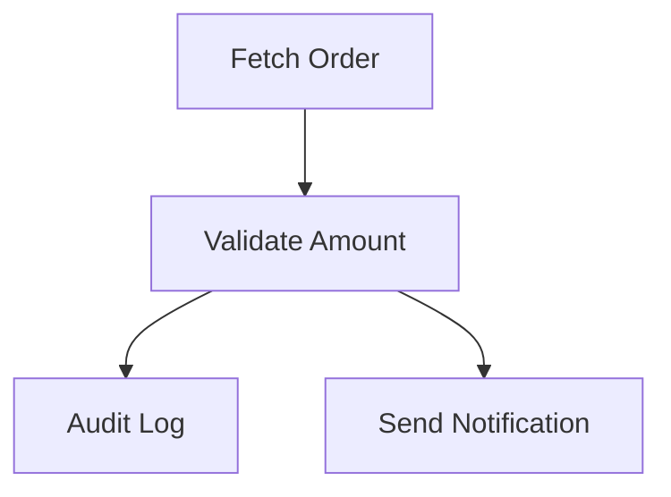

# 🚀 FlowForge

<p align="center">
  
</p>

<p align="center">
  <strong>The Code-First Reactive Workflow Engine for Java & Spring Boot</strong>
</p>

<p align="center">
  <a href="https://github.com/rrguez/flowforge/actions"></a>
  <a href="https://github.com/rrguez/flowforge/blob/main/LICENSE"></a>
  <a href="https://central.sonatype.com/artifact/org.royada.flowforge/flowforge-spring-boot-starter"></a>
</p>

---

## 📖 Complete Documentation & Tutorial
Everything you need to know, from the basic setup to advanced parallel orchestration, is available in our official site:

### 🔗 [https://rrguez.github.io/flowforge/](https://rrguez.github.io/flowforge/)

---

## 🔥 Why FlowForge?

Most workflow engines force you into complex XML files or fragile `Map<String, Object>` contexts. **FlowForge flips the model.**

*   **🛡️ Type-Safe by Default**: If types don't match, your workflow fails at **startup**, not at 3 AM in production.
*   **⚡ Reactive-First**: Built on Project Reactor. Non-blocking, backpressure-aware, and highly concurrent.
*   **🔗 Zero Glue Code**: The output of one task automatically becomes the input of the next.
*   **🧠 High Performance**: Uses pre-resolved `MethodHandles` instead of heavy runtime reflection.

---

## 🛠️ Quick Start

### 1. Define your Tasks
```java
@Component
@TaskHandler
public class OrderTasks {
    @FlowTask(id = "validate")
    public Mono<Boolean> validate(Order order) {
        return Mono.just(order.getAmount() > 0);
    }
}
```

### 2. Compose the Workflow
```java
@Bean
@FlowWorkflow(id = "order-flow")
public WorkflowExecutionPlan plan(FlowDsl dsl) {
    return dsl.flow(OrderTasks::fetch)
              .then(OrderTasks::validate)
              .build();
}
```

### 3. Execute!
```java
client.executeResult("order-flow", orderRequest);
```

---

## 📊 Visual Inspection
FlowForge includes built-in tools to export your designs to **Mermaid** or **JSON**:



---

## 📦 Installation

### Gradle
```gradle
implementation("org.royada.flowforge:flowforge-spring-boot-starter:1.1.0")
```

### Maven
```xml
<dependency>
  <groupId>org.royada.flowforge</groupId>
  <artifactId>flowforge-spring-boot-starter</artifactId>
  <version>1.1.0</version>
</dependency>
```

---

## ⭐ Support the Project
If you find FlowForge useful, consider giving it a ⭐ on GitHub! 

[Learn more at the official docs](https://rrguez.github.io/flowforge/)

---
📄 **License**: Apache 2.0
